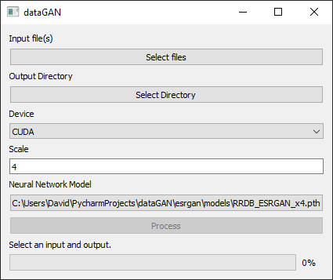

# dataGAN

A PyQt GUI wrapper for [ESRGAN](https://github.com/xinntao/ESRGAN). Based on the work of Xintao Wang, et al.



## Setup

* Install [Python 3.7](https://www.python.org/).
* Install [PyTorch](https://pytorch.org/get-started/locally/).
* Install the things in the `requirements.txt` file.
    ```
    pip install -r requirements.txt
    ```
* Run dataGAN
    ```
    python3 datagan.py
    ```

## Disclaimer

I don't actually know how any of the neural network stuff works. I just made a GUI around what it was already doing.
Please don't ask me if some error comes up and it says something about a model. I probably won't be able to help you.
You can make an issue on this repository if you want, but no guarantees that it'll get answered.